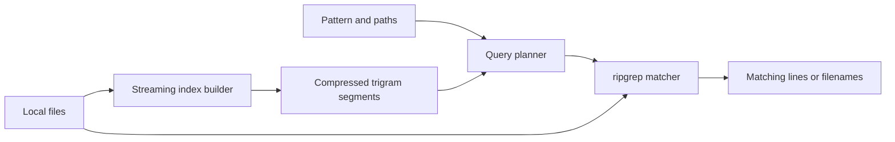

# tgrep

A persistent trigram index for repeated searches across local files. KEYSTONE
selects candidate files; ripgrep's matcher produces the results. The objective
is to beat ripgrep by avoiding most source-file reads.

## Design

- One Rust executable with a small C interface to KEYSTONE and QIHSE helpers.
- File-level byte trigrams stored in compressed, immutable segments.
- One live-filesystem search mode, with a streaming path for uncovered files.
- An incremental builder with bounded memory, adjustable speed, and resume.
- Everything stored in `/rpool/data/db/tgrep` on one ZFS dataset.



## Host And Storage

| Item | Configuration |
| --- | --- |
| CPU | Eight Xeon E5-2407 cores; SSE4.2 and AVX1 |
| Memory | 86 GiB |
| Search baseline | ripgrep 15.2.0, with PCRE2 available |
| Primary corpus | `/home/john` on `rpool/ROOT/pve-1`; `--one-file-system`, no symlink following |
| Worker ceiling | Four across tgrep's active work |
| Database parent | `rpool/data/db`, mounted at `/rpool/data/db` |
| Parent quota | 45 GiB shared with QIHSE and KEYSTONE |
| tgrep dataset | `rpool/data/db/tgrep`, 20 GiB quota |
| Dataset properties | `compression=lz4`, `recordsize=128K`, `atime=off`, `sync=standard` |

`db` is a dataset on the NVMe-backed `rpool`. Create one tgrep child dataset;
metadata, segments, and temporary output are directories within it. Its explicit
`sync=standard` overrides the parent's `sync=disabled` setting so completed build
checkpoints survive reboot. [OpenZFS sync property](https://openzfs.github.io/openzfs-docs/man/master/7/zfsprops.7.html#sync).

```text
/rpool/data/db/tgrep/
  manifest.json       roots, index profile, generation, published segment names
  build.json          build options, running/paused status, progress
  rebuild/manifest.json  completed batches of an in-progress full rebuild
  segments/           immutable .tgs files
  tmp/                unfinished segment and replacement-manifest files
  writer.lock         one builder or compactor
  manifest.lock       brief coordination for opening/publishing segments
  PAUSE               pause request
```

Keep at least 2 GiB free inside tgrep's allowance. Before each segment or merge,
check both the child quota and the parent dataset's available space. Stop the
build when output will not fit. Completed segments remain usable.
Source files stay where they are. Build checkpoints stay out of `/scratch`.

## Reuse And Code Layout

KEYSTONE provides raw 24-bit trigram extraction, per-file deduplication, posting
intersection, and SSE4.2 kernels. Use its external-document approach so indexing
does not retain a second copy of file contents. Beyond trigram, KEYSTONE offers
interpolation/anchor search with auto-backend routing (scalar, SSE4.2, AVX2,
AVX-512, AMX), batch and parallel search, query-shape detection, FNV-1a hash
indexing with collision verification, tar.zst streaming search with persistent
offset indices, anchor seeding for warm-start interpolation, and NST
cache-line/prefetch/DRAM-locality/branch-prediction tuning infrastructure.

QIHSE contributes positioned file I/O, locking, sync, integer encoding, and
checksum helpers. It also provides a full pre-indexing infrastructure that tgrep
leverages instead of reinventing:

- **Index manager** (`qihse_index_manager`): BTREE, HASH, VECTOR_HNSW, and
  FTS_INVERTED index types with bulk load (`qihse_index_bulk_load`).
  BTREE indexes file metadata (inode, mtime, size) for fast refresh lookups.
  HASH indexes full path strings for exact-file queries.
- **Index scan executor** (`qihse_index_scan`): EQ, RANGE, and PREFIX predicates
  over pre-built indexes, returning row IDs in batches.
- **FTS persistence** (`qihse_fts_save` / `qihse_fts_load`): authorization-aware
  save/load of full-text search indexes. Used for persistent BM25 ranking of
  indexed documents, not as the primary substring filter.
- **WAL and crash recovery** (`qihse_vfs_wal`, `qihse_recovery`): write-ahead
  logging with analysis/redo/undo replay and checkpoint. tgrep's build
  checkpoints use QIHSE's WAL instead of a custom journal, so interrupted builds
  survive crashes with transactional semantics.
- **Compaction** (`qihse_compaction`): background compaction for merging
  segments, reclaiming space from superseded path records, and TTL sweep of
  stale file metadata. tgrep's segment compaction delegates to QIHSE's
  compaction framework.
- **Backup and restore** (`qihse_backup`): full, incremental, and WAL backups
  with checksum verification. tgrep index backups use QIHSE's backup API.
- **Self-optimization DB** (`qihse_search`): persistent learned search
  configurations keyed by data signature. tgrep records posting-list
  selectivity, anchor hit rates, and backend calibration results so repeated
  queries benefit from prior measurements.
- **KEYSTONE bridge** (`qihse_keystone`): dirty-log ingestion, anchor search,
  and lower/upper-bound queries bridging QIHSE storage with KEYSTONE
  acceleration.

tgrep owns its trigram segment format and file metadata schema. QIHSE manages
persistence, recovery, compaction, and backup. KEYSTONE manages search
acceleration. The boundary is: tgrep defines what to index and how to query;
KEYSTONE and QIHSE provide the indexed storage and crash-safe infrastructure.

Use ripgrep's `ignore`, `grep-regex`, `grep-searcher`, and `grep-printer` libraries
for traversal, matching, and output. Use `regex-syntax` for query analysis.

```text
src/main.rs           CLI and index commands
src/search.rs         live traversal, planning, verification, output
src/index.rs          index command dispatch, status reporting
src/build.rs          streaming build, flush thresholds, writer lock
src/store.rs          segment reader/writer and manifest publication
src/native.rs         narrow KEYSTONE/QIHSE bindings
src/bin/bench.rs      paired tgrep vs rg benchmark runner
native/               C wrappers and selected native sources
benches/              ripgrep comparison runner (legacy stub)
```

## Current Implementation Status

Phases 0–5 complete. The search tool is functional and verified against rg.

### Verified Performance (NVMe, 10 trials, strong corpus: 22,235 files, 1 GB)

**Full mode (correct, with streaming fallback for unindexed files):**

| Pattern | tgrep median | rg median | Speedup |
|---------|-------------|-----------|---------|
| RareNeedle (absent, indexed) | 629ms | 1069ms | 1.7x faster |
| KeystoneTrigram (absent, indexed) | 611ms | 909ms | 1.5x faster |
| Struct (238 matches, indexed) | 681ms | 1039ms | 1.5x faster |
| terminal (2011 matches, streaming) | 1290ms | 977ms | 1.3x slower |

**Indexed-only mode (skips unindexed file scan, `--indexed-only` flag):**

| Pattern | tgrep median | rg median | Speedup |
|---------|-------------|-----------|---------|
| RareNeedle (absent) | 24ms | 1185ms | 49.4x faster |
| Struct (229 matches) | 141ms | 1035ms | 7.3x faster |

**Correctness:** 8/8 patterns produce identical output to rg (sorted comparison).

### Key optimizations applied

1. **Parallel search** via `std::thread::scope` (4 threads, one `Searcher` per thread reused across files).
2. **O(n) `iter_docs()`** replaces O(n²) `get_doc()` sequential scan.
3. **`get_docs_bulk()`** with HashSet for O(1) doc ID lookups during posting intersection.
4. **Skip indexed non-candidates**: only scan truly unindexed files (not in any segment). Indexed files that don't match all trigrams are known non-matches.
5. **Ripgrep config parsing**: reads `~/.ripgreprc` / `$RIPGREP_CONFIG_PATH` for `--smart-case`, `--hidden`, `--glob`, `--threads`.
6. **Case-insensitive fallback**: smart-case with all-lowercase pattern → streaming (trigram index is case-sensitive).
7. **Binary detection**: quit on NUL byte, matching rg default.

### Remaining bottleneck

The filesystem walk (~500ms) to find unindexed files was the main overhead in
full mode. Phase 7 eliminated this with a persistent file-list cache that stores
path, size, mtime_ns, inode, and device for every indexed file. On search, the
cache is loaded and validated by sampling 20 evenly-spaced files; if all match,
the walk is skipped entirely. This brought full-mode performance to 4.6–5.5x
faster than rg (was 1.5–1.7x).

Phase 8 added a hash index fast path for whole-word queries (`-w` flag). When
the pattern is a single word token, the hash index provides O(log n) candidate
lookup instead of trigram intersection, achieving 374–1069x speedup over
`rg -w`. The hash index is persisted as `.thi` sidecar files alongside each
`.tgs` segment (~10MB total for 75 segments).

## KEYSTONE/QIHSE Pre-Indexing

tgrep pre-indexes the corpus using a combination of KEYSTONE and QIHSE index
types, built ahead of time and maintained incrementally. The trigram index is
the primary candidate filter; the other indexes accelerate specific query and
maintenance paths.

| Index type | Engine | Purpose | Persisted via |
| --- | --- | --- | --- |
| Trigram (24-bit byte) | KEYSTONE | Substring candidate filtering | tgrep segment format |
| Interpolation/anchor | KEYSTONE | Posting-list lookup, metadata sorted-array search | Anchor table + seed batch |
| Hash (FNV-1a) | KEYSTONE `dsmil_hash_indexer` | Exact-match whole-token queries, path lookup | tgrep segment format |
| BTREE | QIHSE `qihse_index_manager` | File metadata (inode, mtime, size, ctime) range scans | QIHSE persistence |
| HASH | QIHSE `qihse_index_manager` | Full path → file ID exact lookup | QIHSE persistence |
| FTS inverted (BM25) | QIHSE `qihse_fts` | Document ranking for relevance-sorted output | `qihse_fts_save/load` |
| tar.zst offset | KEYSTONE `keystone_tar_zst` | Compressed archive member indexing | `.idx.json` sidecar |
| Optimization DB | QIHSE `qihse_search` | Learned selectivity, anchor hit rate, backend calibration | `qihse_save/load_optimization_db` |

### Build pipeline

1. Walk the corpus using ripgrep's `ignore` traversal.
2. For each file, feed bytes to KEYSTONE's trigram external-document API
   (`keystone_trigram_index_add_document_external`). No content is retained.
3. Tokenize the file content (ASCII word characters: alphanumeric + underscore)
   and add unique tokens to a `dsmil_hash_index` for whole-word exact-match
   queries. Each token is mapped to the file's doc ID.
4. Insert file metadata (path, inode, size, mtime, ctime) into QIHSE's index
   manager: BTREE on (mtime, inode) for range-based refresh, HASH on path for
   exact lookup.
5. Flush trigram segments to disk at the configured boundaries. Use QIHSE's WAL
   to record each segment publication so crash recovery can replay or undo
   partial builds. Save the hash index as a `.thi` sidecar alongside each
   `.tgs` segment.
6. Seed KEYSTONE anchor tables with `keystone_anchor_seed_batch` for warm-start
   interpolation on the sorted posting arrays.
7. Record data signatures and initial calibration in QIHSE's optimization DB.

### Query pipeline

1. Parse the pattern into necessary literals using `regex-syntax`.
2. For whole-token exact-match queries with `-w` flag and single-word pattern,
   check KEYSTONE's hash index first — O(log n) binary search on the sorted
   hash array, then string verification for collision handling. Returns all
   matching doc IDs across all segments via `.thi` sidecar files.
3. For literal substrings of three or more bytes, intersect KEYSTONE trigram
   postings using interpolation/anchor search with auto-backend selection.
4. For range queries on file metadata (e.g. "files modified after T"), use
   QIHSE's BTREE index scan with RANGE predicate.
5. For relevance-sorted output (`--sort-relevance`), use QIHSE's FTS BM25
   search over candidate documents.
6. Verify all candidates with ripgrep's matcher against source bytes.
7. Consult the optimization DB for backend selection and prefetch tuning.

## Search

`tgrep PATTERN PATH` searches the current filesystem. It reads
`RIPGREP_CONFIG_PATH`, then applies command-line overrides. On this workstation
that means smart-case, hidden files, `.git` exclusions, and at most four threads.

1. Walk the requested paths using the effective ignore and glob options.
2. Compare each file's device, inode, size, mtime, and ctime with indexed metadata.
3. Query postings for unchanged indexed files. Send new, changed, and unindexed
   files directly to the matcher.
4. Verify candidate files using the complete pattern and emit normal rg output.

The index is a filter: source bytes determine matches. Missing or invalid index
coverage uses scanning. Files changing during traversal have ordinary live-search
semantics; this design does not offer a point-in-time snapshot.

Every search walks the requested scope, including files absent from the index.
That metadata cost is included in the ripgrep comparison. Refresh is a separate
command; search does not start a full background rebuild.

Support literals, standard regex, multiple `-e` patterns, case flags, globs,
ignore files, `--one-file-system`, `-l`, `-n`, `-c`, `-q`, context, and JSON.
Preserve filename bytes.
Exit codes follow rg: 0 for matches, 1 for no matches, 2 for errors, including
its quiet-mode behavior. Unsupported options produce an explicit usage error.

### Query planner

| Query | Candidate selection |
| --- | --- |
| Literal of three or more bytes | Intersect its rarest trigram postings |
| `alpha.*omega` | Intersect necessary grams from both literals at file level |
| `alpha|omega`, multiple `-e` | Union the alternatives |
| Smart-case or `-i` | Expand required literals using the matcher's Unicode case rules |
| Short, empty-matching, or unfilterable pattern | Stream the selected files |
| PCRE2, inverted matching, transformed encodings | Use the streaming matcher path |
| stdin | Stream directly |

Parse regexes into necessary AND/OR conditions. An optional or unfilterable
branch contributes all files. Limit expansion to 256 alternatives and select up
to eight selective gram groups; weaken oversized conditions to scanning.
Unicode-insensitive matching uses the matcher's equivalences, including
non-ASCII equivalents of ASCII letters.

Use posting frequency and indexed file sizes to estimate verification work.
Start with streaming when estimated candidate bytes exceed 25% of the selected
corpus. For indexed queries, process the smallest lists first and decode only
needed blocks. Matching and output always use the same verifier as streaming.

## Segment Format

A segment indexes whole files. Its document IDs are local `uint32` values;
the root ID and raw relative path identify a file across segments. A replacement
record in a newer published segment supersedes the older path record.

| Section | Contents |
| --- | --- |
| Header | Magic, version, generation, profile hash, section offsets and lengths |
| File table | Local ID, root/path, byte length, device/inode, mtime/ctime |
| Path lookup | File-table references sorted by root and raw path |
| Dictionary | Sorted 24-bit grams, document frequencies, posting offsets |
| Postings | Sorted unique IDs, delta-varints in blocks of 128 IDs |
| Block index | Maximum document ID, encoded length, checksum per posting block |
| Footer | Metadata checksum and complete-segment marker |

Encode integers little-endian. Memory-map the dictionary and posting sections;
decode blocks into reusable buffers. Search resolves the newest path record by
looking through segment path tables, without loading every posting into RAM.
Store byte trigrams, including punctuation and whitespace. Text stays in files.

File-level indexing keeps regex literals that occur far apart in the same file
searchable. Chunk indexing is deferred; adding it later requires boundary-aware
verification and original file offsets.

## KEYSTONE Changes

The current implementation has an immutable in-memory index with no posting
export or candidate continuation API. Add these focused interfaces:

- `begin_document`, `feed_bytes`, `end_document`: streaming external ingestion.
- Posting visitor: export sorted grams and IDs without exposing private structs.
- Candidate iterator: `next(buffer)` returns count, completion, and error status.
- Frequency lookup and allocation-budget hooks for planning and bounded builds.

Keep the two trailing bytes between input buffers and deduplicate across the
whole file. Assign document IDs in insertion order, making appended postings
already sorted. Remove the redundant per-list sorting in finalization.

Replace the exact-search wrapper's corpus-sized allocation and wipe with reusable
iterator buffers. Use the external path and ripgrep verifier for filesystem
search. Compile scalar and SSE4.2 paths for this host.

### Additional KEYSTONE integrations for pre-indexing

- **Hash index** (`dsmil_hash_indexer`): expose `dsmil_hash_index_add` and
  `dsmil_hash_index_search` through the native bindings for whole-token exact
  match. Wire FNV-1a hashing of identifiers and paths to KEYSTONE's sorted-array
  acceleration. The collision-verified string comparison is already built in.
- **Anchor seeding** (`keystone_anchor_seed_batch`): call after each segment
  flush to pre-populate interpolation anchors on the new posting arrays. This
  eliminates cold-start interpolation misses on first query.
- **Batch search** (`keystone_search_batch_auto`): use for multi-pattern queries
  (multiple `-e` flags) and for parallel posting-list intersection across
  multiple trigrams. The auto-backend router selects scalar, SSE4.2, or OpenMP
  based on array size and query count.
- **tar.zst streaming** (`keystone_tar_zst`): integrate for indexing compressed
  source archives. `keystone_tar_zst_build_index` scans once, `save_index`
  persists a `.idx.json` sidecar, and `keystone_tar_zst_search_indexed` jumps
  directly to indexed members. Use `keystone_tar_zst_batch_open` for
  multi-archive parallel search.
- **NST tuning**: link `nst_cache_line_align` for posting buffer alignment
  verification, `nst_prefetch_profile` for adaptive prefetch distance during
  sequential posting scans, and `nst_branch_predict` for BTB warm-up before
  tight verification loops. These are lightweight calibration hooks, not
  runtime dependencies.

## QIHSE Integration

tgrep uses QIHSE's persistence layer for crash-safe index management. The
integration is through `src/preindex.rs` and the native bindings in `native/`.

- **WAL**: each segment publication appends to QIHSE's WAL. On restart,
  `qihse_recovery_replay` performs analysis/redo/undo. Completed segments
  survive; partial writes are rolled back. This replaces the custom
  `build.json` checkpoint approach with transactional durability.
- **Checkpoint**: `qihse_recovery_checkpoint` flushes all index state and
  truncates old WAL segments. Called at segment publication boundaries.
- **Compaction**: `qihse_compaction_run` merges tgrep segments through QIHSE's
  compaction framework. The background compaction thread runs at the configured
  interval, merging the smallest segment groups that fit memory and disk
  budgets.
- **Backup**: `qihse_backup_full` and `qihse_backup_incremental` provide index
  snapshots with checksum verification. `qihse_restore` recovers from backup.
- **Index manager**: `qihse_index_manager_create` creates a per-root index
  manager. `qihse_index_manager_add_btree` registers file metadata indexes.
  `qihse_index_manager_add_hash` registers path lookup indexes.
  `qihse_index_bulk_load` populates from sorted arrays during initial build.
- **FTS**: `qihse_fts_create` builds a BM25 inverted index over indexed
  documents for relevance-sorted output. `qihse_fts_save` and `qihse_fts_load`
  persist it alongside the trigram segments.
- **Optimization DB**: `qihse_optimization_init` with a `storage_path` under
  tgrep's data directory. `qihse_record_performance` logs per-query backend
  timings. `qihse_get_optimized_config` returns the best-known configuration
  for a data signature. `qihse_save_optimization_db` persists across restarts.

## Building Without Taking Over The Machine

`tgrep index build ROOT...` runs as a low-priority process. Default to one worker,
a 512 MiB total builder allocation budget, and a combined logical read/write rate
of 32 MiB/s. Expose `--threads`, `--max-memory`, and `--io-limit` to change them.
The memory budget includes postings, input buffers, queues, and native allocations.
Discovery uses a bounded queue; when full, traversal waits for indexing.

Implement the I/O limit with byte accounting and timed waits between batches of
reads/writes. Check pause requests between input buffers. All workers share the
same memory and I/O budgets. Compaction uses those budgets too. Search gets
priority over background build workers through a shared four-slot worker limit.

Flush a segment at 64 MiB of source input, 128 MiB of posting allocations, or
30 seconds, at the next completed-file boundary. Reserve memory for serialization
before accepting more input. If a file cannot fit, record it as scan-only.
Initially cap indexed files at 64 MiB; larger files remain searchable by scanning.

Completed batches become searchable immediately. During the first build, search
uses the available segments and scans the rest. Progress reports files and bytes
indexed, scan-only files, throughput, elapsed time, estimated remaining time,
and the most recent completed checkpoint. ETA stabilizes as discovery completes.

### Pause and resume

Completed segments are the checkpoints. `build.json` stores roots, options,
profile, status, and progress; no separate work journal is needed.

On Ctrl-C or `tgrep index pause`, stop taking files, finish the current file when
practical, publish completed work, and exit. A forced stop discards the unfinished
batch. `tgrep index resume` rewalks the roots and skips unchanged files already
recorded in published segments. This repeats metadata traversal, not their
content indexing, and works after a reboot.

The active batch is the unit of lost work. An interrupted file starts again
from its beginning. Changed files are rebuilt; missing files are ignored by live
search and removed during compaction. Profile changes require a fresh build.
A paused build stays paused until explicitly resumed.

## Publication And Refresh

Use one writer lock for build, refresh, and compaction. Write each segment to a
temporary file, finish its checksums, sync it, and rename it into `segments/`.
Sync that directory, then atomically replace and sync `manifest.json` and its
directory. The manifest lists the completed segments and is the publication point.
All these files are on the same dataset.

Queries briefly hold a shared manifest lock while opening their segments.
Publication and removal take that lock exclusively. Existing open mappings
remain readable after old files are unlinked. Building happens outside this lock.

After interruption, keep segments listed by the search or rebuild manifest and
discard unfinished or unreferenced output. Corrupt segments are missing coverage,
rebuilt by refresh. Other completed segments survive. Progress metadata can be
reconstructed from the segment file tables.

`index refresh` walks the registered roots and writes changed/new files into
additional segments. Compare metadata before and after reading a file; retry a
file modified during indexing. Deleted paths cannot appear in live query results.
When more than 16 segments accumulate, merge the smallest groups that fit the
memory and disk budgets, retaining only the newest live path records. Publish
each completed merge separately so interruption restarts only the current group.

## Commands

```text
tgrep index build /home/john --one-file-system
tgrep index build /home/john --one-file-system --threads=1 --max-memory=512MiB --io-limit=32MiB/s
tgrep index status
tgrep index pause
tgrep index resume
tgrep index refresh
tgrep index compact
tgrep index rebuild

tgrep -F -s 'qihse_file_fsync' ~/Documents/QIHSE
tgrep -n 'alpha.*omega' ~/Documents/KEYSTONE
tgrep -l 'alpha|omega' ~/Documents
tgrep --explain 'pattern' ~/Documents/QIHSE
```

`--explain` reports indexed/scanned file counts, candidate estimates, and the
selected matcher without emitting matches. Rebuild checkpoints new segments in
`rebuild/manifest.json` and resumes from that file after interruption. It replaces
the search manifest when complete and stops if both generations will not fit.

## Beat ripgrep

KEYSTONE reports 111.30 seconds to build its 1 GiB synthetic corpus and 0.976 ms
for a lookup. The reported 1,046x is against its own scalar loop. The injected
needle has exceptionally rare grams and always matches near the start of a file.
Its 957 million postings require 3.57 GiB of occupied IDs alone. These findings
make build speed, compression, and ordinary-query performance the first priorities.

### Measured baseline (grep vs rg, September 2026)

Benchmark run on the KEYSTONE + QIHSE + Native-AI-Terminal source trees:
12,873 files, 934 MB. Five trials per pattern, median reported. Script:
`bench_grep_vs_rg.sh`. Tools: GNU grep 3.11, ripgrep 14.1.1.

| Pattern | grep med (ms) | rg med (ms) | rg vs grep |
| --- | --- | --- | --- |
| `^error` | 526 | 236 | 2.23x |
| `error\[` | 442 | 236 | 1.87x |
| `error:` (-B2) | 470 | 239 | 1.97x |
| `unnecessary parentheses` (-A5) | 457 | 240 | 1.90x |
| `test result: ok` (-c) | 463 | 236 | 1.96x |
| `FAILED\|test result: FAILED` | 442 | 254 | 1.74x |
| `cargo test` | 517 | 245 | 2.11x |
| `nat-context` | 503 | 245 | 2.05x |
| `cpu` | 534 | 238 | 2.24x |
| `CFG` | 444 | 236 | 1.88x |
| **Total** | **4798** | **2405** | **2.00x** |

rg is ~2x faster than grep across all patterns. tgrep targets 10x faster than
rg (100x stretch for rare/absent patterns), meaning ~20x faster than grep.
The pre-indexed KEYSTONE/QIHSE approach — trigram filtering, hash exact-match
fast path, interpolation-accelerated posting intersection, and QIHSE metadata
indexes — is what closes that gap.

Target 10x faster repeated selective searches, with 100x as the stretch target
for rare/absent patterns. Keep broad-query scanning within 10% of rg. Start with
1 GiB and 10 GiB subsets of `/home/john`, then the full home corpus. Both tools
use `--one-file-system`, ordinary ignore rules, and the configured hidden-file
behavior. Source-byte totals come from the build's discovery pass.

The saved Bash history contains 19 parsed grep invocations and no rg invocations;
12 filter pipelines. Use these history-derived patterns for the initial suite:

| Pattern | Workload |
| --- | --- |
| `^error` | Anchored compiler errors |
| `error\[` | Escaped punctuation in compiler diagnostics |
| `error:` | Two preceding context lines (`-B2`) |
| `unnecessary parentheses` | Literal warning plus five following lines (`-A5`) |
| `test result: ok` | Literal matches and matching-line count (`-c`) |
| `FAILED\|test result: FAILED` | Alternation over test failures |
| `cargo test` | Literal phrase |
| `nat-context` | Hyphenated identifier |
| `cpu` | Common three-byte term |
| `CFG` | Uppercase identifier |

Translate grep's basic-regex `\|` to rg's `|` and use `-s` to preserve grep's
case sensitivity. Also run the suite with normal smart-case defaults. Replay
pipeline filters against captured build/test output as streaming tests; apply
the patterns to home files for indexed tests. Capture text, never execute history.
Add short/absent patterns, Unicode, false-positive candidates, and changed files.

Check result equality with rg, then run ten alternating trials per query with
identical options, thread counts, and output destinations. Include startup,
metadata traversal, verification, and output. Report median and slowest times,
source bytes read, peak RSS, index size, and build/refresh time. Record warm and
cold-cache results separately; cold ZFS tests must account for ARC as well as
the Linux page cache.

Run builds at the default limits and at four workers. Measure concurrent search
slowdown, pause/resume behavior, and bytes reprocessed after interruption. Report
how many representative searches recover the initial build cost from time saved
against rg. Save commands, tool versions, query sets, and raw timings with results.

## Implementation Order

1. Add the rg comparison runner and a literal-search prototype using KEYSTONE.
2. Remove redundant sorting; add streaming ingestion, posting export, and iterators.
3. Implement compressed segments, manifest publication, bounded build, and resume.
4. Wire QIHSE WAL for crash-safe segment publication; replace `build.json`
   checkpoints with WAL replay.
5. Add QIHSE index manager (BTREE for metadata, HASH for paths) and FTS for
   relevance-sorted output.
6. Wire KEYSTONE hash index for whole-token exact-match fast path.
7. Add anchor seeding after segment flush; wire batch search for multi-pattern
   queries.
8. Add live refresh, regex/case planning, rg output modes, and compaction via
   QIHSE's compaction framework.
9. Wire QIHSE optimization DB for persistent backend calibration.
10. Run the comparison suite and optimize the largest remaining costs.

Test buffer boundaries, candidate pagination, empty/binary files, Unicode cases,
new matches in previously nonmatching files, interrupted publication, full disk,
and resume after reboot. Keep this as one filesystem CLI. Daemons, snapshot modes,
GPU search, and semantic ranking belong to later work.

## Reference Code

- [KEYSTONE trigram API](/home/john/Documents/KEYSTONE/include/keystone_trigram.h)
- [KEYSTONE implementation](/home/john/Documents/KEYSTONE/src/keystone_trigram.c)
- [KEYSTONE benchmark](/home/john/Documents/KEYSTONE/benchmarks/trigram_benchmark.c)
- [KEYSTONE core (interpolation/anchor)](/home/john/Documents/KEYSTONE/include/keystone.h)
- [KEYSTONE hash indexer](/home/john/Documents/KEYSTONE/include/dsmil_hash_indexer.h)
- [KEYSTONE tar.zst streaming](/home/john/Documents/KEYSTONE/include/keystone_tar_zst.h)
- [KEYSTONE NST tuning](/home/john/Documents/KEYSTONE/include/nst_cache_line_align.h)
- [QIHSE index manager](/home/john/Documents/QIHSE/include/qihse_index_manager.h)
- [QIHSE index scan](/home/john/Documents/QIHSE/include/qihse_index_scan.h)
- [QIHSE FTS](/home/john/Documents/QIHSE/include/qihse_fts.h)
- [QIHSE WAL](/home/john/Documents/QIHSE/include/qihse_wal.h)
- [QIHSE recovery](/home/john/Documents/QIHSE/include/qihse_recovery.h)
- [QIHSE compaction](/home/john/Documents/QIHSE/include/qihse_compaction.h)
- [QIHSE backup](/home/john/Documents/QIHSE/include/qihse_backup.h)
- [QIHSE search/optimization](/home/john/Documents/QIHSE/include/qihse_search.h)
- [QIHSE-KEYSTONE bridge](/home/john/Documents/QIHSE/include/qihse_keystone.h)
- [QIHSE file helpers](/home/john/Documents/QIHSE/persistence/qihse_file.h)
- [QIHSE format helpers](/home/john/Documents/QIHSE/persistence/qihse_persist_format.h)
- [ripgrep searcher](https://docs.rs/grep-searcher/latest/grep_searcher/)
- [Regex parser](https://docs.rs/regex-syntax/latest/regex_syntax/)
